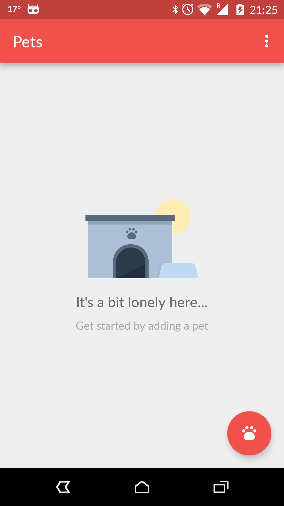
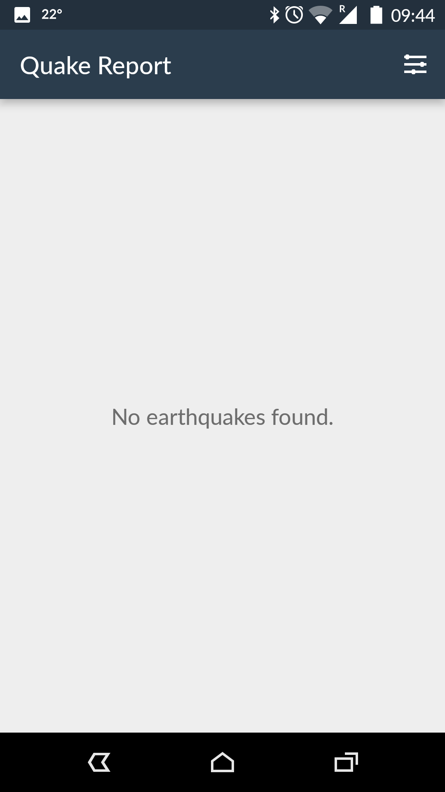
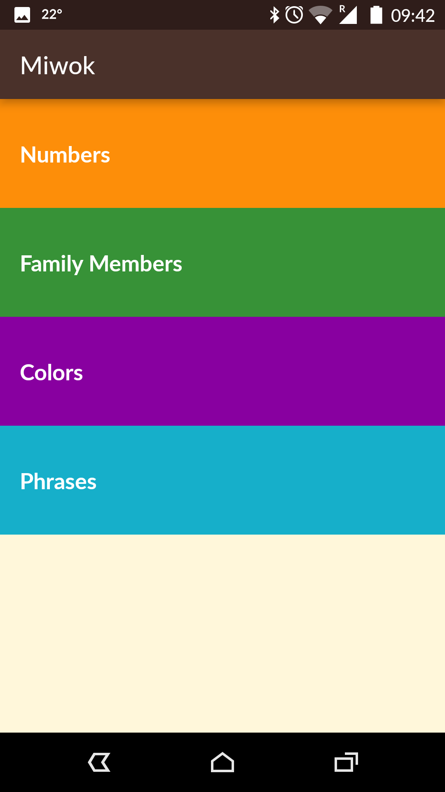
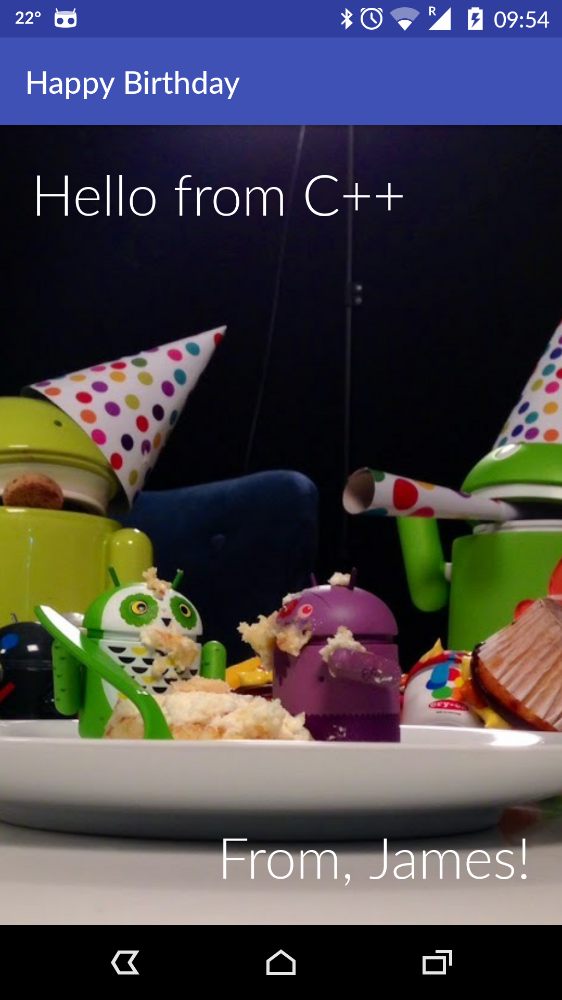
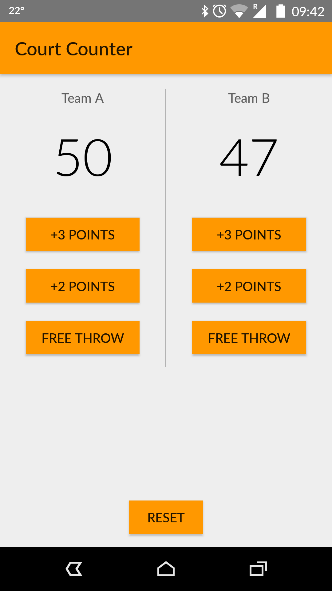
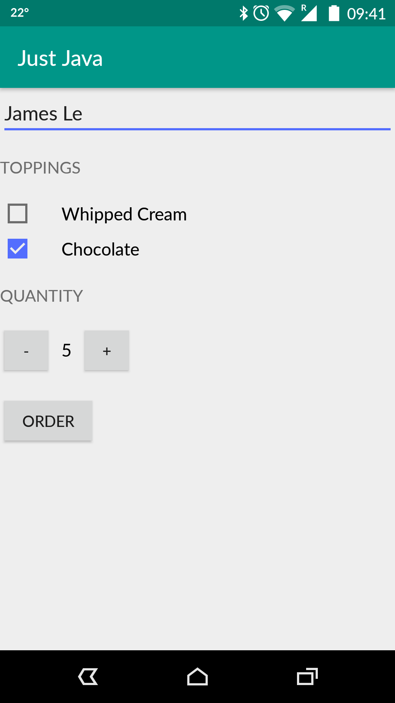

Pets App
===================================

This app displays a list of pets and their related data that the user inputs. Used in a Udacity course in the Android Basics Nanodegree by Google.

Quake Report App
===================================

This app displays a list of recent earthquakes in the world from the U.S. Geological Survey (USGS) organization. Used in Udacity Android for Beginners course.

More info on the USGS Earthquake API available at: https://earthquake.usgs.gov/fdsnws/event/1/

Miwok Sample App
===================================

This app displays lists of vocabulary words for the user to learn the Miwok language. Used in the Udacity Android for Beginners course.

Birthday Card Sample App
===================================

Sample app that displays a birthday card. Used in the Udacity Android for Beginners course.

Court Counter Sample App
===================================

Keeps track of basketball scores for two teams. Used in the Udacity Android for Beginners course.

Just Java Sample App
===================================

This app displays an order form for coffee. Used in the Udacity Android for Beginners course.

Pre-requisites
--------------

- Android SDK v24
- Android Build Tools v24.0.2
- Android Support Repository v24.2.0

Getting Started
---------------

These samples use the Gradle build system. To build these projects, use the
"gradlew build" command or use "Import Project" in Android Studio.

Support
-------

- Google+ Community: https://plus.google.com/communities/105153134372062985968
- Stack Overflow: http://stackoverflow.com/questions/tagged/android

Patches are encouraged, and may be submitted by forking this project and
submitting a pull request through GitHub. Please see CONTRIBUTING.md for more details.

License
-------

Copyright 2015 The Android Open Source Project, Inc.

Licensed to the Apache Software Foundation (ASF) under one or more contributor
license agreements.  See the NOTICE file distributed with this work for
additional information regarding copyright ownership.  The ASF licenses this
file to you under the Apache License, Version 2.0 (the "License"); you may not
use this file except in compliance with the License.  You may obtain a copy of
the License at

http://www.apache.org/licenses/LICENSE-2.0

Unless required by applicable law or agreed to in writing, software
distributed under the License is distributed on an "AS IS" BASIS, WITHOUT
WARRANTIES OR CONDITIONS OF ANY KIND, either express or implied.  See the
License for the specific language governing permissions and limitations under
the License.
